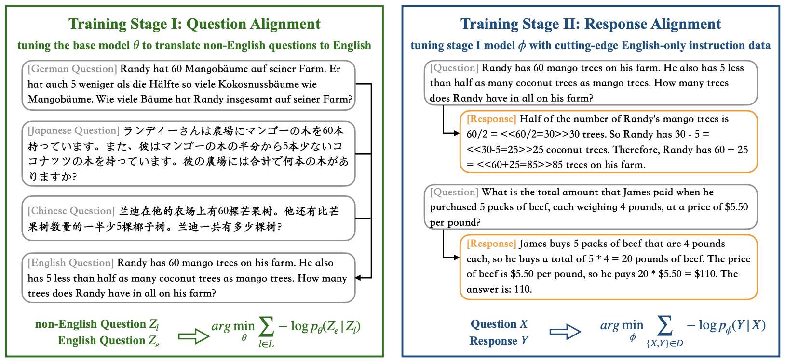

## Question Translation Training for Better Multilingual Reasoning

<p align="center">
  <a href="https://arxiv.org/abs/2401.07817"> 📃 Paper</a> | 
  <a href="https://huggingface.co/Wenhao97"> 🤗 Huggingface</a> | 
  <a href="https://owennju.github.io/"> 📭 Contact</a> 
</p>

### :mountain: Overview 
* This repository shares the code and models of our latest work on multilingual reasoning. In this work, we present a novel X-English question alignment finetuning step which performs targeted language alignment for best use of the LLMs English reasoning abilities.
* Utilizing this library, you can finetune open-source LLMs into strong multilingual reasoning systems. For example, our fine-tuned LLaMA2-7B/13B achieves superior multilingual performance, significantly outperforming baseline models of equivalent size.
* Overall, our method effectively reduces the performance disparity of LLMs across English and non-English languages, showing a new paradigm to unlock LLM’s capabilities to accompolish multilingual tasks.



### :chart_with_upwards_trend: Benchmarks

Below we present LLMs' average answer accuracy (zero-shot) on multilingual reasoning benchmarks. With question alignment, our fine-tuned LLM
surpasses the unaligned counterpart and the translate-training baseline (MathOctopus) by a large margin.

*Our model has been open-sourced on Huggingface.*

|        System (13B)        | Monolingual Supervision | Multilingual Supervision | mGSM | mSVAMP |
|:--------------------------:|:-----------------------:|:------------------------:|:----:|:------:|
| [**QAlign** (ours)](https://huggingface.co/Wenhao97/QAlign-MetaMathQA-13B) |        MetaMathQA       |             -            | 57.1 |  62.6  |
|          [MetaMath](https://huggingface.co/meta-math/MetaMath-13B-V1.0)          |        MetaMathQA       |             -            | 43.9 |  51.8  |          
|         [MathOctopus](https://huggingface.co/Mathoctopus/Parallel_13B)        |            -            |       GSM8KInstruct      | 45.8 |  46.5  |          
|         [WizardMath](https://huggingface.co/WizardLM/WizardMath-13B-V1.0)         |          GSM8K & MATH          |             -            | 28.3 |  35.7  |          
|           [MAmmoTh](https://huggingface.co/TIGER-Lab/MAmmoTH-13B)          |          MathInstruct         |             -            | 28.9 |  38.6  |       
|             [RFT](https://huggingface.co/OFA-Sys/gsm8k-rft-llama13b2-u13b/tree/main)            |          GSM8k-ScRel          |             -            | 29.5 |  37.1  |          
|             [SFT]()            |          GSM8K          |             -            | 29.7 |  38.1  |      

|         System (7B)        | Monolingual Supervision | Multilingual Supervision | mGSM | mSVAMP |
|:--------------------------:|:-----------------------:|:------------------------:|:----:|:------:|
| [**QAlign** (ours)](https://huggingface.co/Wenhao97/QAlign-MetaMathQA-7B) |        MetaMathQA       |             -            | 49.6 |  57.2  |      
|         [MetaMath](https://huggingface.co/meta-math/MetaMath-7B-V1.0)          |        MetaMathQA       |             -            | 38.4 |  46.2  |         
|         [MathOctopus](https://huggingface.co/Mathoctopus/Parallel_7B)        |            -            |       GSM8KInstruct      | 40.0 |  44.1  |         
|         [WizardMath](https://huggingface.co/WizardLM/WizardMath-7B-V1.0)         |          GSM8K & MATH          |             -            | 23.0 |  32.5  |          
|         [MAmmoTh](https://huggingface.co/TIGER-Lab/MAmmoTH-7B)          |          MathInstruct         |             -            | 21.3 |  26.3  |       
|         [RFT](https://huggingface.co/OFA-Sys/gsm8k-rft-llama7b2-u13b/tree/main)            |           GSM8k-ScRel         |             -            | 20.6 |  31.3  |          
|         [SFT]()           |          GSM8K          |             -            | 22.6 |  30.9  |       


### :open_file_folder: Dataset
In the table below, we list datasets that are used in this project. All datasets are available within this repository, with the exception of MetaMathQA. To use MetaMathQA, please download the file MetaMathQA-395K.json with the provided link and place it in the ./data/metamath directory.

|    Dataset    |    Usage   |   Size  |           Languages           | Path |
|:-------------:|:----------:|:-------:|:-----------------------------:| :--: |
|   [MetaMathQA](https://huggingface.co/datasets/meta-math/MetaMathQA)  |  Training  | 395,000 |               En              | ./data/metamath |
| [GSM8KInstruct](https://huggingface.co/datasets/Mathoctopus/GSM8KInstruct_Parallel) |  Training  |  73,559 | En, Bn, Th, Sw, Ja, Zh, De, Fr, Ru, Es | ./data/gsm8kinstruct|
|     [mGSM](https://huggingface.co/datasets/juletxara/mgsm)     | Evaluation |  2,500  | En, Bn, Th, Sw, Ja, Zh, De, Fr, Ru, Es | ./evaluate/scripts/data/mgsm |
|    [mSVAMP](https://huggingface.co/datasets/Mathoctopus/MSVAMP)    | Evaluation |  10,000 | En, Bn, Th, Sw, Ja, Zh, De, Fr, Ru, Es | ./evaluate/scripts/data/msvamp |

### :jigsaw: Installation
To install this repository, follow these steps:
```
git clone git@github.com:NJUNLP/QAlign.git
cd QAlign
pip install --editable ./
```

For detailed information about the conda environment, refer to the environment.yaml file.

### :hammer_and_wrench: Training
We develope our training pipeline based on the [stanford_alpaca](https://github.com/tatsu-lab/stanford_alpaca) repository. 

To perform question alignment and response alignment on pre-trained LLMs, use the following command. Please note that you must replace $PROJECT_PATH with the appropriate paths in finetune.sh or finetune_dp.sh to ensure it is executable. When fine-tuning the 13B model, we utilize [DeepSpeed](https://github.com/microsoft/DeepSpeed) to save memory. You can find our deepspeed configuration in the ./config/ds.json file.

* finetuning LLaMA2-7B
```bash
bash ./training_scripts/finetune_llama2_7B.sh
```

* finetuning LLaMA2-13B
```bash
bash ./training_scripts/finetune_llama2_13B.sh
```

### :straight_ruler: Evaluation
We use the evaluation code provided by [Chen et al.](https://github.com/microsoft/MathOctopus), which meansures answer accuracy by comparing the last numerical number that appears in the LLM-generated response with the gold answer.

To evaluate the model on mGSM and mSVAMP dataset, use the following command. Please note that you must replace $PROJECT_PATH and $MODEL_PATH with the appropriate paths in the script to ensure it is executable.

* evaluating with mGSM
```bash
cd evaluate/scripts

bash evaluate_mgsm.sh
```

* evaluating with mSVAMP
```bash
cd evaluate/scripts

bash evaluate_msvamp.sh
```

### :evergreen_tree: Citation
If you find this repository helpful, feel free to cite our paper:
```
@misc{zhu2024question,
      title={Question Translation Training for Better Multilingual Reasoning}, 
      author={Wenhao Zhu and Shujian Huang and Fei Yuan and Shuaijie She and Jiajun Chen and Alexandra Birch},
      year={2024},
      eprint={2401.07817},
      archivePrefix={arXiv},
      primaryClass={cs.CL}
}
```